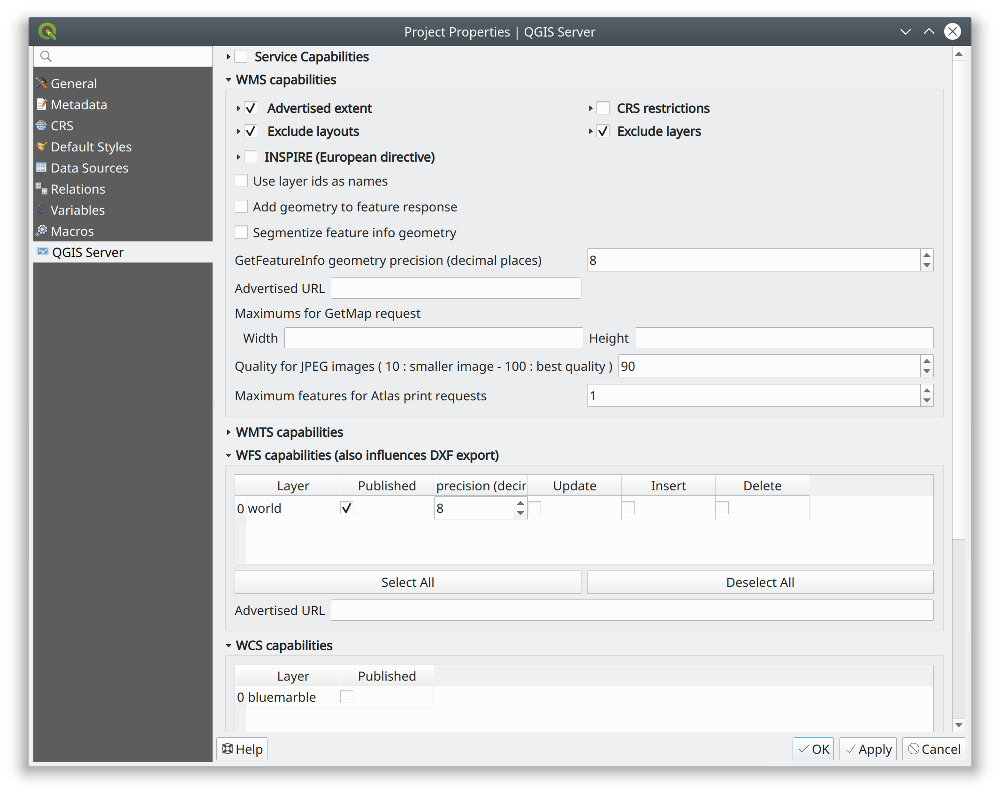
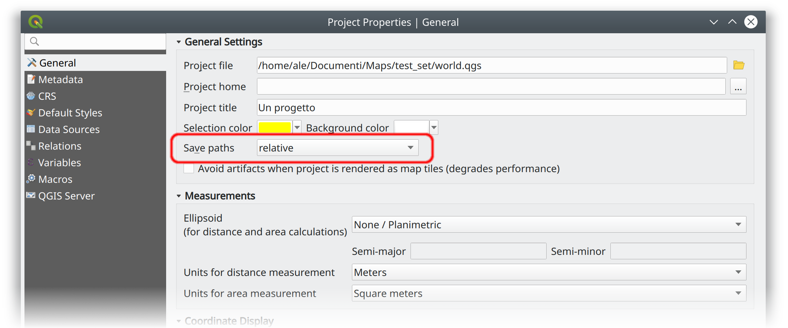

:data-transition-duration: 2000
:skip-help: true
:css: css/custom-hov.css
:css: css/custom.css

.. title:: QGIS Server Workshop 2019

.. header::

   .. image:: images/qgis-icon.png

.. footer::

    Introduction to QGIS Server Workshop 2019

----

WS Program
====================

+ Introduction to QGIS Server
+ General workflow
+ Deployment strategies
+ QGIS Server vendor features
+ Python API
+ Python Plugins
    + Access Control Plugins
    + Cache Plugins
+ Python applications and embedding

----

QGIS Server
===========

.. graph:: images/intro.png
    :class: scale-100 centered

    digraph g {
            rankdir="LR"

            edge [fontcolor=red fontsize=9]
            node [shape=box style="rounded"]

            desktop [label="QGIS Desktop"]
            server [label="QGIS Server"]

            desktop ->  server [label="deploy project"]

    }

.. class:: centered

    The WYSIWYG GIS Server

    From the desktop to the web!

----

Typical workflow
================

.. graph:: images/workflow.png
    :class: scale-70 centered

    digraph g {
            rankdir="TB"

            subgraph cluster_0 {
                style=filled;
                color=lightgrey;
                node [shape=box style=filled,color=white];
                "Prepare Data" -> "Configure QGIS Project";
                label = "Client Tier";
            }

            subgraph cluster_1 {
                style=filled;
                color=lightgrey;
                node [shape=box style=filled,color=white];
                "QGIS Server";
                label = "Server Tier";
            }

            node [shape=box style=box,color=blue]
            edge [color=blue fontsize=9]

            "Configure QGIS Project" -> "Transfer project and data (if local)"
            "Transfer project and data (if local)" -> "QGIS Server";

    }

-----

System overview
=====================

.. graph:: images/system-overview.png
    :class: scale-70 centered

    digraph g {
            rankdir="TB"

            subgraph cluster_0 {
                style=filled;
                color=lightgrey;
                node [style=filled,color=white];
                "Web Server" -> "QGIS Server";
                label = "Server Tier";
                node [style=filled,color=white];
                "QGIS Server" -> "Project 1.qgs"
                "QGIS Server" -> "Project 2.qgs"
                node [shape=box color="blue" style=box,color=blue]
                edge [color=blue fontsize=9]
                "Project 1.qgs" -> "Local Storage"
            }

            edge [fontcolor=red fontsize=9]
            node [shape=box style="rounded"]

            "Client Tier" -> "Web Server";

            node [shape=box color="white"]
            edge [color=red fontsize=9]
            "Multiple processes" -> "QGIS Server";
            "Multiple projects" -> "Project 1.qgs";
            "Multiple projects" -> "Project 2.qgs";

            node [shape=box style=box,color=blue]
            edge [color=blue fontsize=9]
            "Project 2.qgs" -> "Remote Storage"
    }

-----

Configuring the project
=======================

-----

Data Storage
============

-----

Supported standards
====================

+ WMS 1.3
+ WFS 1.0.0, 1.1.0
+ WCS 1.1.1
+ WMTS 1.0.0
+ WFS3 draft (new!)

----

Compliance tests
================

OGC CITE Compliance Testing

CI tests:

http://test.qgis.org/ogc_cite/

-----

QGIS Server Modules
=====================

.. graph:: images/system-architecture.png
    :class: scale-70 centered

    digraph g {
            rankdir="TB"

            style=filled;
            color=lightgrey;

            edge [fontcolor=red fontsize=9]
            node [shape=box style="rounded"]

            "QGIS Server" -> "Plugin filters"

            node [style=filled, shape=box color=gray];

            "Plugin filters" -> "SERVICE"
            "Plugin filters" -> "API"

            node [style=filled, shape=box color=green];

            "API" -> "WFS3"
            "API" -> "Custom API"

            node [style=filled, shape=box color=yellow];

            "SERVICE" -> "WMS/WMTS"
            "SERVICE" -> "WFS"
            "SERVICE" -> "WCS"
            "SERVICE" -> "Custom SERVICE"
    }

----

SERVICE Architecture
======================

``SERVICE`` modules

+ WMS
+ WFS
+ WCS
+ WMTS
+ Custom modules (C++ and Python)
+ Python bindings

----

New API Architecture
====================

``API`` modules

+ WFS3 API handler
+ Custom API handlers (C++ and Python)
+ Python bindings

----

API documentation
=================

https://qgis.org/api/group__server.html

----

Deployment strategies
=====================

1. Docker containers
2. Bare metal or VM

----

Docker images
=====================

.. class:: pull-right

    .. image:: images/docker.svg
        :class: scale-30

.. class:: pull-left

+ https://github.com/kartoza/docker-qgis-server
+ https://github.com/3liz/docker-qgis-server
+ https://github.com/gem/oq-qgis-server
+ https://github.com/elpaso/qgis-server-docker

----

Demo VM stack
=============

==================== ========== ============
Server               Port       Mapped to host
-------------------- ---------- ------------
Nginx **FastCGI**    80         8080
Apache **(Fast)CGI** 81         8081
Nginx **Python**     82         8082
Nginx **MapProxy**   83         8083
==================== ========== ============

----

Requirements summary
====================

.. class:: pull-right

    .. image:: images/apache.png
        :class: scale-30

    .. image:: images/nginx.svg
        :class: scale-30

    .. image:: images/mapproxy.png
        :class: scale-30

.. class:: pull-left

+ **xvfb** (headless X server, required by QT)

+ **Apache2**: web server
+ **mod_fcgid** Apache module for FastCGI

+ **Nginx**: web server
+ **systemd** (Linux process manager, for FastCGI + nginx)

Optional:

+ **MapProxy**: Python based WMS/WFS/TMS caching proxy

----

Bare metal - OS Setup
=====================

We are using *Ubuntu Bionic 64bit*

https://github.com/elpaso/qgis3-server-vagrant

in Vagrant it is provided by the *box*:

https://cloud-images.ubuntu.com/bionic/current/bionic-server-cloudimg-amd64-vagrant.box

----

Setup steps
=====================

+ add QGIS repositories
+ install QGIS server
+ install support software packages
+ configure services
+ start services

----

Provided VMs
====================

1. Unprovisioned (software installed, no configuration)
    You need to make the configuration manually or run the provisioning scripts from::
    /vagrant/provisioning

2. Fully provisioned (ready to run)

----

SSH into the machine
====================

Vagrant:

.. code:: bash

    vagrant up
    vagrant ssh
    sudo su - # become superuser

Plain VM (username: qgis, password: qgis):

.. code:: bash

    ssh -p 2222 qgis@localhost # password: qgis
    sudo su - # become superuser

**Checkpoint**: you need to be able to log into the machine and become ``root``

----

Add resources from workshop repository
======================================

Only for unprovisioned machines!

.. code:: bash

    wget https://github.com/elpaso/qgis3-server-vagrant/archive/master.zip
    unzip master.zip
    rm -rf /vagrant/ # if exists
    mv qgis3-server-vagrant-master/ /vagrant
    rm master.zip
    cd /vagrant/provisioning

----

The provisioning scripts
======================================

+ config.sh (configuration)
+ setup.sh (complete setup)
+ download_only.sh (download only)

Steps:

+ common.sh
+ apache2.sh
+ nginx.sh
+ mapproxy.sh

----

Add required repositories
=========================

.. code:: bash

    # Add QGIS repositories
    apt-key adv --keyserver keyserver.ubuntu.com --recv-key 51F523511C7028C3
    echo 'deb http://qgis.org/ubuntu-nightly bionic main' > /etc/apt/sources.list.d/ubuntu-qgis.list
    apt-get update && apt-get -y upgrade

----

Check new packages
=========================

**Checkpoint**: the available version of qgis-server must be >= 3 from qgis.org

.. code:: bash

    apt-cache policy qgis-server
    # output follows:
    qgis-server:
    Installed: 1:3.5.0+git20190214+dabd649+28bionic
    Candidate: 1:3.5.0+git20190214+dabd649+28bionic
    Version table:
    *** 1:3.5.0+git20190214+dabd649+28bionic 500
            500 http://qgis.org/debian-nightly bionic/main amd64 Packages
            100 /var/lib/dpkg/status
        2.18.17+dfsg-1 500
            500 http://archive.ubuntu.com/ubuntu bionic/universe amd64 Packages

----

Install system software
=======================

Install the software, see::

    /vagrant/provisioning/config.sh
    /vagrant/provisioning/common.sh

.. code:: bash

    # Common configuration
    export QGIS_SERVER_DIR=/qgis-server
    export DEBIAN_FRONTEND=noninteractive
    # Install QGIS server and deps (overwrite is a temporary solution)
    apt-get -y install -o Dpkg::Options::="--force-overwrite" qgis-server python3-qgis xvfb
    # Install utilities (optional)
    apt-get -y install vim unzip ipython3

----

Install system software I
===========================

**Checkpoint**: qgis installed with no errors, you can check it with

.. code:: bash

    /usr/lib/cgi-bin/qgis_mapserv.fcgi 2> /dev/null
    Content-Length: 54
    Content-Type: text/xml; charset=utf-8
    Server:  Qgis FCGI server - QGis version 3.0.0-Girona
    Status:  500

    <ServerException>Project file error</ServerException>

----

Install system software II
===========================

Copy resources

.. code:: bash

    . /vagrant/provisioning/config.sh

    # Install sample projects and plugins
    mkdir -p $QGIS_SERVER_DIR/logs
    cp -r /vagrant/resources/web/htdocs $QGIS_SERVER_DIR
    cp -r /vagrant/resources/web/plugins $QGIS_SERVER_DIR
    cp -r /vagrant/resources/web/projects $QGIS_SERVER_DIR
    chown -R www-data.www-data $QGIS_SERVER_DIR

----

Install system software III
=============================

Setup *xvfb* and plain **CGI**

.. code:: bash

    # Setup xvfb
    cp /vagrant/resources/xvfb/xvfb.service \
        /etc/systemd/system/xvfb.service
    systemctl enable /etc/systemd/system/xvfb.service
    service xvfb start

    # Symlink to cgi for apache CGI mode
    ln -s /usr/lib/cgi-bin/qgis_mapserv.fcgi \
        /usr/lib/cgi-bin/qgis_mapserv.cgi

----

Apache2
======================

Installation (with **FCGI** module)

    The Apache HTTP Server Project is an effort to develop and maintain an open-source HTTP server for modern operating systems including UNIX and Windows. The goal of this project is to provide a secure, efficient and extensible server that provides HTTP services in sync with the current HTTP standards.

.. code:: bash

    apt-get -y install apache2 libapache2-mod-fcgid

----

Apache2 architecture
=====================

.. graph:: images/apache-architecture.png
    :class: scale-80 centered

    digraph g {
            rankdir="TB"

            subgraph cluster_0 {
                style=filled;
                color=yellow;
                node [shape=box style=filled,color=white];
                "Apache Web Server" -> "Apache FastCGI module (mod_fcgid)";
                label = "Apache";
            }

            node [shape=box style=box,color=blue]
            edge [color=blue fontsize=9 dir=both]

            "Apache FastCGI module (mod_fcgid)" -> "QGIS Server FastCGI";

    }

-----

Apache2 configuration I
=========================

Configure the web server

.. code:: bash

    cp /vagrant/resources/apache2/001-qgis-server.conf \
        /etc/apache2/sites-available
    # sed: replace QGIS_SERVER_DIR with actual path
    sed -i -e "s@QGIS_SERVER_DIR@${QGIS_SERVER_DIR}@g" \
        /etc/apache2/sites-available/001-qgis-server.conf
    # sed: replace port from 80 to 81
    sed -i -e 's/VirtualHost \*:80/VirtualHost \*:81/' \
        /etc/apache2/sites-available/001-qgis-server.conf
    sed -i -e "s@QGIS_SERVER_DIR@${QGIS_SERVER_DIR}@g" \
        $QGIS_SERVER_DIR/htdocs/index.html

-----

Apache2 configuration II
=========================

VirtualHost configuration for both **FastCGI** and **CGI**

.. code:: bash

    <VirtualHost *:81>
        # [ ... ] Standard config goes here
        FcgidInitialEnv LC_ALL "en_US.UTF-8"
        FcgidInitialEnv LANG "en_US.UTF-8"
        FcgidInitialEnv PYTHONIOENCODING UTF-8
        FcgidInitialEnv QGIS_DEBUG 1
        FcgidInitialEnv QGIS_PLUGINPATH "QGIS_SERVER_DIR/plugins"
        FcgidInitialEnv QGIS_AUTH_DB_DIR_PATH "QGIS_SERVER_DIR"
        # Path to the QGIS3.ini settings file
        FcgidInitialEnv QGIS_OPTIONS_PATH "QGIS_SERVER_DIR"
        # Path to the user profile directory
        FcgidInitialEnv QGIS_CUSTOM_CONFIG_PATH "QGIS_SERVER_DIR"
        FcgidInitialEnv DISPLAY ":99"

-----

Apache2 configuration III
=========================

**Logging**

.. code:: bash

        FcgidInitialEnv QGIS_DEBUG 1
        # Deprecated log to file (bad practice!)
        FcgidInitialEnv QGIS_SERVER_LOG_FILE "QGIS_SERVER_DIR/logs/qgis-apache-001.log"
        # Log to stderr instead:
        # FcgidInitialEnv QGIS_SERVER_LOG_FILE ""
        # FcgidInitialEnv QGIS_SERVER_LOG_STDERR 1
        FcgidInitialEnv QGIS_SERVER_LOG_LEVEL 0
        FcgidInitialEnv QGIS_PLUGINPATH "QGIS_SERVER_DIR/plugins"

-----

Apache2 configuration IV
=========================

**CGI**

.. code:: bash

        # For simple CGI: ignored by fcgid,
        # Same as FastCGI, but "SetEnv" instead of "FcgidInitialEnv"
        SetEnv LC_ALL "en_US.UTF-8"
        SetEnv LANG "en_US.UTF-8"
        SetEnv PYTHONIOENCODING UTF-8
        ...

----

Apache2 configuration V
=========================

.. code:: bash

        # Required by QGIS plugin HTTP BASIC auth
        <IfModule mod_fcgid.c>
            RewriteEngine on
            RewriteCond %{HTTP:Authorization} .
            RewriteRule .* - [E=HTTP_AUTHORIZATION:%{HTTP:Authorization}]
        </IfModule>
        ScriptAlias /cgi-bin/ /usr/lib/cgi-bin/
        <Directory "/usr/lib/cgi-bin">
            AllowOverride All
            Options +ExecCGI -MultiViews +FollowSymLinks
            Allow from all
            AddHandler cgi-script .cgi
            AddHandler fcgid-script .fcgi
            Require all granted
        </Directory>
    </VirtualHost>

-----

Apache2 configuration VI
=========================

Enable sites and restart

.. code:: bash

    a2enmod rewrite # Only required by some plugins
    a2enmod cgid # Required by plain old CGI
    a2dissite 000-default
    a2ensite 001-qgis-server
    # Listen on port 81 instead of 80 (nginx)
    sed -i -e 's/Listen 80/Listen 81/' /etc/apache2/ports.conf
    service apache2 restart # Restart the server

**Checkpoint**: check whether Apache is listening on localhost port 8081 http://localhost:8081

----

Nginx Installation
===================

    nginx [engine x] is an HTTP and reverse proxy server, a mail proxy server, and a generic TCP/UDP proxy server

.. code:: bash

    # Install the software
    export DEBIAN_FRONTEND=noninteractive
    apt-get -y install nginx

----

Nginx architecture
=====================

.. graph:: images/nginx-architecture.png
    :class: scale-70 centered

    digraph g {
            rankdir="TB"

            subgraph cluster_0 {
                style=filled;
                color=green;
                node [shape=box style=filled,color=white];
                "Nginx Web Server";
                label = "Nginx";
            }

            subgraph cluster_1 {
                style=filled;
                color=yellow;
                node [shape=box style=filled,color=white];
                "Systemd Managed Socket";
                "Systemd Managed Service";
                label = "Systemd";
            }

            node [shape=box style=box,color=blue]
            edge [color=blue fontsize=9 dir=both]

            "Systemd Managed Service" -> "QGIS Server FastCGI";
            "Nginx Web Server" -> "Systemd Managed Socket";
            "Systemd Managed Socket" -> "QGIS Server FastCGI";
    }

----

Nginx configuration I
=======================

.. code:: bash

    # Enable site
    rm /etc/nginx/sites-enabled/default
    cp /vagrant/resources/nginx/qgis-server-fcgi \
        /etc/nginx/sites-enabled/qgis-server
    # sed: replace QGIS_SERVER_DIR with actual path
    sed -i -e "s@QGIS_SERVER_DIR@${QGIS_SERVER_DIR}@" \
        /etc/nginx/sites-enabled/qgis-server

----

Nginx configuration II
=======================

.. code:: bash

    # Extract server name and port from HTTP_HOST, this
    # is required because we are behind a VMs mapped port

    map $http_host $parsed_server_name {
        default  $host;
        "~(?P<h>[^:]+):(?P
.*+)" $h;
    }

    map $http_host $parsed_server_port {
        default  $server_port;
        "~(?P<h>[^:]+):(?P
.*+)" $p;
    }

----

Nginx configuration III
=======================

Load balancing
(round robin default, or least_conn;)

.. code:: ruby

    upstream qgis_mapserv_backend {
        ip_hash;
        server unix:/run/qgis_mapserv4.sock;
        server unix:/run/qgis_mapserv3.sock;
        server unix:/run/qgis_mapserv2.sock;
        server unix:/run/qgis_mapserv1.sock;
    }

+ Sessions and persistence (ip-hash)!
+ Caching

----

Nginx configuration IV
=======================

.. code:: bash

    server {
        listen 80 default_server;
        listen [::]:80 default_server;

        # This is vital
        underscores_in_headers on;

        root /qgis-server/htdocs;

        location / {
                # First attempt to serve request as file, then
                # as directory, then fall back to displaying a 404.
                try_files $uri $uri/ =404;
        }

----

Nginx configuration V
=======================

Rewrite!

.. code:: bash

        # project file set by env var
        # example: http://localhost:8080/project/project_base_name/
        location ~ ^/project/([^/]+)/?(.*)$
        {
          set $qgis_project /qgis-server/projects/$1.qgs;
          rewrite ^/project/(.*)$ /cgi-bin/qgis_mapserv.fcgi last;
        }

----

Nginx configuration VI
=======================

.. code:: bash

        location /cgi-bin/ {
            # Disable gzip (it makes scripts feel slower since they
            # have to complete before getting gzipped)
            gzip off;

            # Fastcgi socket
            fastcgi_pass  qgis_mapserv_backend;

            # $http_host contains the original server name and port, such as: "localhost:8080"
            fastcgi_param SERVER_NAME       $parsed_server_name;
            fastcgi_param SERVER_PORT       $parsed_server_port;

            # [ continue ... ]

----

Nginx configuration VII
=======================

.. code:: bash

            # [ ... continued ]

            # Set project file from env var
            fastcgi_param QGIS_PROJECT_FILE $qgis_project;

            # Fastcgi parameters, include the standard ones
            # (note: this needs to be last or it will overwrite fastcgi_param set above)
            include /etc/nginx/fastcgi_params;

        }
    }

----

Systemd socket config for FastCGI
===================================

Socket

.. code:: bash

    # Path: /etc/systemd/system/qgis-server-fcgi@.socket
    # systemctl enable qgis-server-fcgi@{1..4}.socket && systemctl start qgis-server-fcgi@{1..4}.socket

    [Unit]
    Description = QGIS Server FastCGI Socket (instance %i)
    [Socket]
    SocketUser = www-data
    SocketGroup = www-data
    SocketMode = 0660
    ListenStream = /run/qgis_mapserv%i.sock

    [Install]
    WantedBy = sockets.target

----

Systemd service config for FastCGI
===================================

.. code:: bash

    # Path: /etc/systemd/system/qgis-server-fcgi@.service
    # systemctl start qgis-server-fcgi@{1..4}.service

    [Unit]
    Description = QGIS Server Tracker FastCGI backend (instance %i)
    [Service]
    User = www-data
    Group = www-data
    ExecStart = /usr/lib/cgi-bin/qgis_mapserv.fcgi
    StandardInput = socket
    StandardOutput=syslog
    StandardError=syslog
    SyslogIdentifier=qgis-server-fcgi
    WorkingDirectory=/tmp
    Restart = always

----

Systemd config for FastCGI 3
===================================

Service

.. code:: bash

    # Environment
    Environment="QGIS_AUTH_DB_DIR_PATH=QGIS_SERVER_DIR/projects"
    Environment="QGIS_SERVER_LOG_FILE=QGIS_SERVER_DIR/logs/qgis-server-fcgi.log"
    Environment="QGIS_SERVER_LOG_LEVEL=0"
    Environment="QGIS_DEBUG=1"
    Environment="DISPLAY=:99"
    Environment="QGIS_PLUGINPATH=QGIS_SERVER_DIR/plugins"
    Environment="QGIS_OPTIONS_PATH=QGIS_SERVER_DIR"
    Environment="QGIS_CUSTOM_CONFIG_PATH=QGIS_SERVER_DIR"

    [Install]
    WantedBy = multi-user.target

----

Checkpoint: Nginx
===========================

Check **WMS** on localhost 8080 in the browser

http://localhost:8080

Follow the links!

----

Checkpoint: QGIS as a Client
===================================

Check **WMS** and **WFS** using QGIS as a client.

Check that **WFS** requires a "username" and "password"

Check that **WWS** *GetFeatureInfo* returns a (blueish) formatted HTML

Note: a test project with pre-configured endpoints
is available in the ``resources/qgis/`` directory.

----

Checkpoint: WMS search
=================================

Searching features with **WMS**

.. code::

    http://localhost:8080/cgi-bin/qgis_mapserv.fcgi?
    MAP=/qgis-server/projects/helloworld.qgs&SERVICE=WMS
    &REQUEST=GetFeatureInfo&CRS=EPSG%3A4326&WIDTH=1794&HEIGHT=1194
    &LAYERS=world&QUERY_LAYERS=world&
    FILTER=world%3A%22NAME%22%20%3D%20%27SPAIN%27

The filter is a QGIS Expression:

**FILTER=world:"NAME" = 'SPAIN'**

* Field name is enclosed in double quotes, literal string in single quotes
* You need one space between the operator and tokens

----

WMS vendor parameters
=======================

Full list:  https://docs.qgis.org/testing/en/docs/user_manual/working_with_ogc/server/services.html

+ **WITH_GEOMETRY** (FALSE|TRUE)
+ **WITH_MAPTIPS** (FALSE|TRUE)

.. code::

    http://localhost:8081/cgi-bin/qgis_mapserv.fcgi?
    INFO_FORMAT=application/json&MAP=/qgis-server/projects/helloworld.qgs
    &SERVICE=WMS&REQUEST=GetFeatureInfo&CRS=EPSG%3A4326&WIDTH=1794&HEIGHT=1194&LAYERS=world&
    WITH_GEOMETRY=TRUE&QUERY_LAYERS=world&FILTER=world%3A%22NAME%22%20%3D%20%27SPAIN%27

----

Checkpoint: highlighting
=================================

The **SELECTION** parameter can highlight features from one or more layers:
Vector features can be selected by passing comma separated lists with feature ids in *GetMap* and *GetPrint*.
Example: *SELECTION=mylayer1:3,6,9;mylayer2:1,5,6*

.. code::

    http://localhost:8080/cgi-bin/qgis_mapserv.fcgi?
    MAP=/qgis-server/projects/helloworld.qgs&SERVICE=WMS&VERSION=1.3.0&
    SELECTION=world%3A44&REQUEST=GetMap&FORMAT=image%2Fpng&TRANSPARENT=true&
    LAYERS=world&CRS=EPSG%3A4326&STYLES=&DPI=180&WIDTH=1794&HEIGHT=1194&
    BBOX=31.7944%2C-18.2153%2C58.0297%2C21.20361

----

Checkpoint: printing
==============================

From composer templates (with substitutions!)

.. code:: xml

  <Layouts>
    <Layout units="mm" printResolution="300" name="Printable World"
    worldFileMap="{db75b0bf-f2f1-42e6-9727-1b6b21d8862e}">
    ...

FORMAT can be any of PDF, PNG
See also: DXF Export

----

Checkpoint: printing URL
==============================

.. code::

    http://localhost:8080/cgi-bin/qgis_mapserv.fcgi?
    MAP=/qgis-server/projects/helloworld.qgs&SERVICE=WMS&VERSION=1.1.1&
    REQUEST=GetPrint&TEMPLATE=Printable%20World&CRS=EPSG%3A4326&
    map0:EXTENT=4,52,14,58&FORMAT=png&LAYERS=bluemarble,world

----

Checkpoint: printing substitutions
===================================

- Assign an *ID* to the label
- add *label_name=Your custom text*
- as an ID, choose a word that is not reserved in **WMS**

.. code::

    http://localhost:8080/cgi-bin/qgis_mapserv.fcgi?
    MAP=/qgis-server/projects/helloworld.qgs&SERVICE=WMS&
    VERSION=1.1.1&REQUEST=GetPrint&TEMPLATE=Printable%20World
    &CRS=EPSG%3A4326&map0:EXTENT=4,52,14,58&FORMAT=png
    &LAYERS=bluemarble,world&print_title=Custom%20print%20title!

----

QGIS Server 3 and python
============================

.. code:: python

    from qgis.core import QgsApplication
    from qgis.server import *
    qgs_app = QgsApplication([], False)
    qgs_server = QgsServer()
    request = QgsBufferServerRequest(
        'http://localhost:8081/?MAP=/qgis-server/projects/helloworld.qgs' +
        '&SERVICE=WMS&REQUEST=GetCapabilities')
    response = QgsBufferServerResponse()
    qgs_server.handleRequest(request, response)
    print(response.headers(), response.body())
    qgs_app.exitQgis()

Full script:
https://github.com/qgis/QGIS/blob/master/tests/src/python/qgis_wrapped_server.py

----

QGIS Server and python plugins
==================================

See presentation: http://www.itopen.it/bulk/nodebo/Presentations/Server%20Plugins/index.html

API: Server https://qgis.org/pyqgis/master/server/index.html

There are no substantial differences between plugins API in 2.x and 3.x

----

Access Control Plugins
==================================

Since QGIS 2.12

Fine-grained control over layers, features and attributes!

https://docs.qgis.org/testing/en/docs/pyqgis_developer_cookbook/server.html#access-control-plugin

Example:
https://github.com/elpaso/qgis3-server-vagrant/blob/master/resources/web/plugins/accesscontrol/accesscontrol.py

----

Cache plugins
============================

Since QGIS 3.4

.. code:: python

    from qgis.server import QgsServerCacheFilter
    from qgis.core import QgsMessageLog
    from qgis.PyQt.QtCore import QByteArray
    import hashlib

    class StupidCache(QgsServerCacheFilter):
        """A simple in-memory and not-shared cache for demonstration purposes"""
        _cache = {}
        def _get_hash(self, request):
            # create a unique hash from the request
            paramMap = request.parameters()
            urlParam = "&".join(["%s=%s" % (k, paramMap[k]) for k in paramMap.keys()])
            m = hashlib.md5()
            m.update(urlParam.encode('utf8'))
            return m.hexdigest()

----

Cache plugins II
============================

.. code:: python

        def getCachedDocument(self, project, request, key):
            hash = self._get_hash(request)
            try:
                result = self._cache[self._get_hash(request)]
                return result
            except KeyError:
                return QByteArray()

        def setCachedDocument(self, doc, project, request, key):
            hash = self._get_hash(request)
            self._cache[hash] = doc
            return True

    serverIface.registerServerCache(StupidCache(serverIface), 100 )

----

QGIS Server 3.x and python services
===================================

Since QGIS 3

New server **plugin-based** service architecture!

You can now create custom services in pure *Python*.

Example: https://github.com/elpaso/qgis3-server-vagrant/blob/master/resources/web/plugins/customservice/customservice.py

----

QGIS Server 3.x and python custom APIs
======================================

Since QGIS 3.10

New server **plugin-based** API architecture!

You can now create custom APIs in pure *Python*.

Example: https://github.com/elpaso/qgis3-server-vagrant/blob/master/resources/web/plugins/customapi/customapi.py

----

QGIS Server Python API
==================================

+ ``QgsServer()`` server instance
+ ``QgsBufferServerRequest(url)``
+ ``QgsBufferServerResponse()``
+ ``QgsServer.handleRequest(request, response)``

----

QGIS Server Python app: the basics
==================================

.. code:: python

    from qgis.core import *
    from qgis.server import *
    app = QgsApplication([], False)
    s = QgsServer()
    request = QgsBufferServerRequest('?MAP=/qgis-server/projects/helloworld.qgs&REQUEST=GetCapabilities&SERVICE=WMS')
    response = QgsBufferServerResponse()
    s.handleRequest(request, response)
    print(response.body().data().decode('utf8'))

-----

QGIS Server Python application 1
================================

Systemd

.. code:: bash

    # Listen on ports 809%i
    # Path: /etc/systemd/system/qgis-server-python@.service
    # systemctl start qgis-server-python@{1..4}.service

    [Unit]
    Description = QGIS Server Tracker Python backend (instance %i)
    [Service]
    User = www-data
    Group = www-data
    ExecStart = /qgis-server/qgis_wrapped_server_wsgi.py
    StandardInput = null
    StandardOutput=syslog
    StandardError=syslog
    SyslogIdentifier=qgis-server-python
    WorkingDirectory=/tmp
    Restart = always

----

QGIS Server Python application 2
================================

Systemd

.. code:: bash

    # Environment
    Environment=QGIS_SERVER_PORT=809%i
    Environment="QGIS_AUTH_DB_DIR_PATH=/qgis-server/projects"
    Environment="QGIS_SERVER_LOG_FILE=/qgis-server/logs/qgis-server-python.log"
    Environment="QGIS_SERVER_LOG_LEVEL=0"
    Environment="QGIS_DEBUG=1"
    Environment="DISPLAY=:99"
    Environment="QGIS_PLUGINPATH=/qgis-server/plugins"
    Environment="QGIS_OPTIONS_PATH=/qgis-server"
    Environment="QGIS_CUSTOM_CONFIG_PATH=/qgis-server"
    [Install]
    WantedBy = multi-user.target

----

Caching
============================

A QGIS Server instance caches:

+ capabilities
+ projects

Caches are **not** shared among instances.

Layers are **not** cached.

Caching is generally delegated to different tier,
caching solutions are expecially recommended for serving
tiles:

+ mapproxy https://mapproxy.org/
+ tilecache http://tilecache.org/
+ tilestache http://tilestache.org/

Look for metatiles support if your layers contain labels.

----

Other examples
=====================

The Python QGIS tests contain a comprehensive set
of scripts to test all possible services of QGIS
Server:

https://github.com/qgis/QGIS/tree/master/tests/src/python

----

Authenticated layers in QGIS Server
===================================

QGIS authentication DB ``qgis-auth.db`` path can be specified with
the environment variable ``QGIS_AUTH_DB_DIR_PATH``

``QGIS_AUTH_PASSWORD_FILE`` environment variable can contain the
master password required to decrypt the authentication DB.

.. warning::

    Make sure to limit the file as only readable by the Server’s process user and to not store the file within web-accessible directories.

----

Parallel rendering
============================================

``QGIS_SERVER_PARALLEL_RENDERING``

Activates parallel rendering for WMS GetMap requests. It’s disabled (false) by default. Available values are:

0 or false (case insensitive)
1 or true (case insensitive)

``QGIS_SERVER_MAX_THREADS``

Number of threads to use when parallel rendering is activated. Default value is -1 to use the number of processor cores.

----

Logging
=======

``QGIS_SERVER_LOG_FILE`` (deprecated)

Specify path and filename. Make sure that server has proper permissions for writing to file. File should be created automatically, just send some requests to server. If it’s not there, check permissions.

``QGIS_SERVER_LOG_STDERR`` (best option)

``QGIS_SERVER_LOG_LEVEL``

Specify desired log level. Available values are:

0 or ``INFO`` (log all requests)
1 or ``WARNING``
2 or ``CRITICAL`` (log just critical errors, suitable for production purposes)

-----

Release cycle
=============

LTR: 12 months support

https://www.qgis.org/it/site/getinvolved/development/roadmap.html#release-schedule

-----

Presentation links
=========================

https://github.com/elpaso/qgis3-server-vagrant/ (docs folder)