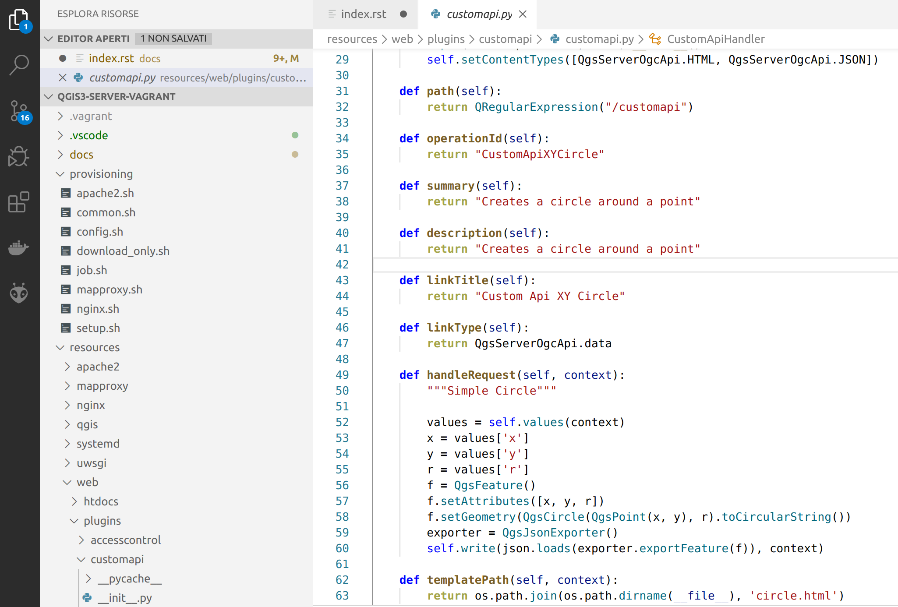

:data-transition-duration: 2000
:skip-help: true
:css: css/custom-hov.css
:css: css/custom.css

.. title:: QGIS Server Workshop 2020

.. include:: <isonum.txt>

----

:id: presentation-title

QGIS Server With Python Superpowers
~~~~~~~~~~~~~~~~~~~~~~~~~~~~~~~~~~~
Workshop
~~~~~~~~

Alessandro Pasotti

QCooperative / ItOpen

----

Workshop Program
====================

+ Introduction to QGIS Server
+ General workflow
+ Deployment strategies
+ Server configuration
+ QGIS Server vendor features
+ Python development
+ Python applications and embedding
+ Python Plugins & Modules
    + Access Control Plugins
    + Cache Plugins
    + Custom Services & APIs

----

QGIS Server
===========

.. graph:: images/intro.png
    :class: force-150 centered

    digraph g {

        rankdir="LR"

        graph [fontname = "helvetica bold"];
        node [fontname = "helvetica bold"];
        edge [fontname = "helvetica bold"];

        edge [fontcolor=red fontsize=9]
        node [shape=box style="rounded"]

        desktop [label="QGIS Desktop"]
        server [label="QGIS Server"]
        desktop ->  server [label="deploy project"]

    }

.. class:: centered

    The *WYSIWYG* GIS Server

    From the desktop to the web!

----

Typical Workflow
================

.. graph:: images/workflow.svg
    :class: scale-70 centered

    digraph g {

        compound=true;

        graph [fontname = "helvetica bold"];
        node [fontname = "helvetica bold"];
        edge [fontname = "helvetica bold"];

        rankdir="TB"

        subgraph cluster_0 {
            style=filled;
            color=lightgrey;
            node [shape=box style=filled,color=white];
            "Prepare Data" -> "Configure QGIS Project";
            label = "QGIS Desktop";
        }

        subgraph cluster_1 {
            style=filled;
            color=lightgrey;
            node [shape=box style=filled,color=white];
            "Serve Requests";
            label = "QGIS Server";
        }

        node [shape=box style=box,color=blue]
        edge [color=blue fontsize=9]

        "Configure QGIS Project" -> "Transfer project and data (if local)"
        "Transfer project and data (if local)" -> "Serve Requests" [ltail=cluster_0,lhead=cluster_1];

    }

-----

Supported Standards
====================

+ WMS 1.3
+ WFS 1.0.0, 1.1.0
+ WCS 1.1.1
+ WMTS 1.0.0
+ WFS3/OAPIF (new!)

----

Compliance Tests
================

OGC CITE Compliance Testing

CI tests:

http://test.qgis.org/ogc_cite/

-----

System Overview
=====================

.. graph:: images/system-overview.svg
    :class: scale-70 centered

    digraph g {

        graph [fontname = "helvetica bold"];
        node [fontname = "helvetica bold"];
        edge [fontname = "helvetica bold"];
        rankdir="TB"

        subgraph cluster_0 {
            style=filled;
            color=lightgrey;
            node [style=filled,color=white];
            "QGIS Server FCGI";
            "Web Server" -> "QGIS Server FCGI";
            label = "Server Tier";

            subgraph cluster_1 {
                color=white;
                label = "Server Data";
                node [shape=box,style=filled,color=white];
                node [shape=box color="blue" style=box,color=blue]
                edge [color=blue fontsize=9]
                "project_1.qgs";
                "project_2.qgs";
                "Local Storage";
            }

            "QGIS Server FCGI" -> "project_1.qgs"
            "QGIS Server FCGI" -> "project_2.qgs"

        }

        edge [fontcolor=red fontsize=9]
        node [shape=box style="rounded"]

        "Client Tier" -> "Web Server";

        node [shape=box color="white"]
        edge [color=red fontsize=9]
        "Multiple processes\nManaged by systemd or mod_fcgid" -> "QGIS Server FCGI";
        "Multiple projects\nMAP=..." -> "project_1.qgs";
        "Multiple projects\nMAP=..." -> "project_2.qgs";

        node [shape=box style=box,color=blue]
        edge [color=blue fontsize=9]
        "project_2.qgs" -> "Local Storage"
        "project_2.qgs" -> "Remote Storage"
        "project_1.qgs" -> "Remote Storage"
    }

-----

Project Configuration
=======================

.. image:: images/server-options.png
    :class: centered

Official documentation: https://docs.qgis.org/testing/en/docs/user_manual/working_with_ogc/server/index.html

-----

Data Storage
============

.. image:: images/project-properties.png
    :class: centered

-----

Project File Storage
====================

* **FILESYSTEM** |rarr| ``MAP=/path/to/project.qgs`` or *rewrite*!
* **DB** |rarr| ``MAP=postgres://[user[:pass]@]host[:port]/?dbname=X&schema=Y&project=Z`` or *rewrite*!

.. class:: warning

    Use rewrite!

Specifiers:

* first .QGS from binary directory
* ``MAP=``
* environment variable ``QGIS_PROJECT_FILE``

----

Deployment Strategies
=====================

1. Docker Containers
~~~~~~~~~~~~~~~~~~~~

   + \- you have to know Docker
   + \+ you can easily replicate/move/scale deployments

2. Bare Metal or VM
~~~~~~~~~~~~~~~~~~~

   + \+ maybe easier to setup/customize

----

Docker Images
=====================

.. class:: pull-right

    .. image:: images/docker.svg
        :class: scale-30

.. class:: pull-left

+ https://github.com/kartoza/docker-qgis-server
+ https://github.com/3liz/docker-qgis-server
+ https://github.com/gem/oq-qgis-server
+ https://github.com/elpaso/qgis-server-docker

----

Demo VM Stack
=============

==================== ========== ============
Server               Port       Mapped to host
-------------------- ---------- ------------
Nginx **FastCGI**    80         8080
Apache **(Fast)CGI** 81         8081
Nginx **Python**     82         8082
Nginx **MapProxy**   83         8083
Development server   8000       8000
==================== ========== ============

.. class:: warning

    Plain **CGI** is only useful for testing!

----

The Development Server
======================

*Not suitable for production!*

.. code:: bash
    :class: zoom-80

    Usage: qgis_mapserver [options] [address:port]
    QGIS Development Server

    Options:
    -l <logLevel>     Sets log level (default: 0)
                        0: INFO
                        1: WARNING
                        2: CRITICAL
    -p <projectPath>  Path to a QGIS project file (*.qgs or *.qgz),
                        if specified it will override the query string MAP argument
                        and the QGIS_PROJECT_FILE environment variable

    Arguments:
    addressAndPort    Listen to address and port (default: "localhost:8000")
                        address and port can also be specified with the environment
                        variables QGIS_SERVER_ADDRESS and QGIS_SERVER_PORT

----

FCGI Requirements Summary
=========================

.. graph:: images/fcgi-summary.svg
    :class: scale-80 centered

    digraph g {

        graph [fontname = "helvetica bold"];
        node [fontname = "helvetica bold"];
        edge [fontname = "helvetica bold"];

        rankdir="TB"

        node [shape=box]
        "QGIS FCGI"

        node [shape=box style="rounded"]
        edge [color=red fontsize=9]

        "Web Server (Apache/Nginx)\n\n- Request routing\n- Address rewriting\n- Load balancing" -> "QGIS FCGI"

        node [shape=box style="rounded"]

        "xvfb Headless X Server\n\n- Rendering" -> "QGIS FCGI"

        "FCGI Supervisor (systemd)\n\n- Manages FCGI processes lifecycle" -> "xvfb Headless X Server\n\n- Rendering"
        "FCGI Supervisor (systemd)\n\n- Manages FCGI processes lifecycle" -> "QGIS FCGI"
        "FCGI Supervisor (apache mod_fcgid)\n\n- Manages FCGI processes lifecycle" -> "QGIS FCGI"

    }

.. class:: warning

    **xvfb** is required for features like printing and HTML labels.

----

Advanced QGIS Server Configuration
==================================

12 factors app https://12factor.net/

Configuration through **environment variables**

+ Paths to plugins, default project etc.
+ Layers Authentication
+ Parallel Rendering
+ Logging

----

Authenticated Layers in QGIS Server
===================================

QGIS authentication DB ``qgis-auth.db`` path can be specified with
the environment variable ``QGIS_AUTH_DB_DIR_PATH``

``QGIS_AUTH_PASSWORD_FILE`` environment variable can contain the
master password required to decrypt the authentication DB.

.. class:: warning

    Make sure that the permissions on the file are set to be only readable by
    the Server’s process user and check that the file is not accessible
    via any URL.

.. class:: warning

    TODO for QGIS4: ``QGIS_AUTH_PASSWORD`` needs to be added.

----

Parallel Rendering
============================================

``QGIS_SERVER_PARALLEL_RENDERING``

Activates parallel rendering for WMS GetMap requests. It’s disabled (false) by default. Available values are:

0 or false (case insensitive)
1 or true (case insensitive)

``QGIS_SERVER_MAX_THREADS``

Number of threads to use when parallel rendering is activated. Default value is -1 to use the number of processor cores.

----

Logging
=======

``QGIS_SERVER_LOG_FILE`` (deprecated)

Specify path and filename. Make sure that server has proper permissions for writing to file. File should be created automatically, just send some requests to server. If it’s not there, check permissions.

``QGIS_SERVER_LOG_STDERR`` (best option)

``QGIS_SERVER_LOG_LEVEL``

Specify desired log level. Available values are:

0 or ``INFO`` (log all requests)
1 or ``WARNING``
2 or ``CRITICAL`` (log just critical errors, suitable for production purposes)

----

Caching
============================

A QGIS Server instance caches:

+ capabilities XML document

Caches are **not** shared among instances, layers are **not** cached.

Caching is generally delegated to different tier,
caching solutions are expecially recommended for serving
tiles:

+ mapproxy https://mapproxy.org/
+ tilecache http://tilecache.org/
+ tilestache http://tilestache.org/

Look for metatiles and/or activate `TILE` buffer support if your layers contain labels.

----

WFS3/OAPIF and the new OGC APIs
===============================

Resources overrides (HTML templates, JS/CSS etc.):

Base directory for all WFS3 static resources (HTML templates, CSS, JS etc.) ``QGIS_SERVER_API_RESOURCES_DIRECTORY``

https://docs.qgis.org/testing/en/docs/user_manual/working_with_ogc/server/services.html#the-html-template-language

----

VM Stack Summary
====================

.. class:: pull-right

    .. image:: images/apache.png
        :class: scale-30

    .. image:: images/nginx.svg
        :class: scale-30

    .. image:: images/mapproxy.png
        :class: scale-30

.. class:: pull-left

+ **xvfb** (headless X server, required by QT)

+ **Apache2**: web server
+ **mod_fcgid** Apache module for FastCGI

Alternative:

+ **Nginx**: web server
+ **systemd** (Linux process manager, for FastCGI + nginx)

Optional:

+ **MapProxy**: Python based WMS/WFS/TMS caching proxy

----

Bare Metal - OS Setup
=====================

We are using *Ubuntu Bionic 64bit*

https://github.com/elpaso/qgis3-server-vagrant

in Vagrant it is provided by the *box*:

https://cloud-images.ubuntu.com/bionic/current/bionic-server-cloudimg-amd64-vagrant.box

----

Setup Steps
=====================

+ Add QGIS repositories
+ Install support packages (Nginx, Apache etc.)
+ Install QGIS server
+ Configure services
+ Start services
+ Test services

----

Provided VMs
====================

1. **Unprovisioned** (software installed, no configuration)
    You need to make the configuration manually or run the provisioning scripts from::

        /vagrant/provisioning

2. **Fully provisioned** (ready to run)

----

SSH into the Machine
====================

Vagrant:

.. code:: bash

    vagrant up
    vagrant ssh
    sudo su - # become superuser

Plain VM (username: qgis, password: qgis):

.. code:: bash

    ssh -p 2222 qgis@localhost # password: qgis
    sudo su - # become superuser

**Checkpoint**: you need to be able to log into the machine and become ``root``

----

Add Resources from Workshop Repository
======================================

Only for unprovisioned machines!

.. code:: bash

    wget https://github.com/elpaso/qgis3-server-vagrant/archive/master.zip
    unzip master.zip
    rm -rf /vagrant/ # if exists
    mv qgis3-server-vagrant-master/ /vagrant
    rm master.zip
    cd /vagrant/provisioning

----

The Provisioning Scripts
======================================

+ config.sh (configuration)
+ setup.sh (complete setup)
+ download_only.sh (download only)

Steps:

+ common.sh
+ apache2.sh
+ nginx.sh
+ mapproxy.sh

----

Add Required Repositories
=========================

.. code:: bash

    # Add QGIS repositories
    apt-key adv --keyserver keyserver.ubuntu.com --recv-key 51F523511C7028C3
    echo 'deb http://qgis.org/ubuntu-nightly bionic main' > /etc/apt/sources.list.d/ubuntu-qgis.list
    apt-get update && apt-get -y upgrade

Which repository? https://qgis.org/en/site/forusers/alldownloads.html#debian-ubuntu

----

Check for New Packages
=========================

**Checkpoint**: the available version of qgis-server must be >= 3 from qgis.org

.. code:: bash

    apt-cache policy qgis-server
    # output follows:
    qgis-server:
    Installed: 1:3.11.0+git20200214+51ba7e8a89+28bionic
    Candidate: 1:3.11.0+git20200214+51ba7e8a89+28bionic
    Version table:
    *** 1:3.11.0+git20200214+51ba7e8a89+28bionic 500
           500 http://qgis.org/ubuntu-nightly bionic/main amd64 Packages
           100 /var/lib/dpkg/status
        2.18.17+dfsg-1 500
           500 http://it.archive.ubuntu.com/ubuntu bionic/universe amd64 Packages

----

Install System Software
=======================

Install the software, see::

    /vagrant/provisioning/config.sh
    /vagrant/provisioning/common.sh

.. code:: bash

    # Common configuration
    export QGIS_SERVER_DIR=/qgis-server
    export DEBIAN_FRONTEND=noninteractive
    # Install QGIS server and deps (overwrite is a temporary solution)
    apt-get -y install -o Dpkg::Options::="--force-overwrite" qgis-server python3-qgis xvfb
    # Install utilities (optional)
    apt-get -y install vim unzip ipython3

----

Install System Software I
===========================

**Checkpoint**: qgis installed with no errors, you can check it with

.. code:: bash

    /usr/lib/cgi-bin/qgis_mapserv.fcgi 2> /dev/null
    Content-Length: 54
    Content-Type: text/xml; charset=utf-8
    Server:  Qgis FCGI server - QGis version 3.0.0-Girona
    Status:  500

    <ServerException>Project file error</ServerException>

----

Install System Software II
===========================

Copy resources

.. code:: bash

    . /vagrant/provisioning/config.sh

    # Install sample projects and plugins
    mkdir -p $QGIS_SERVER_DIR/logs
    cp -r /vagrant/resources/web/htdocs $QGIS_SERVER_DIR
    cp -r /vagrant/resources/web/plugins $QGIS_SERVER_DIR
    cp -r /vagrant/resources/web/projects $QGIS_SERVER_DIR
    chown -R www-data.www-data $QGIS_SERVER_DIR

----

Install System Software III
=============================

Setup *xvfb* and plain **CGI**

.. code:: bash

    # Setup xvfb
    cp /vagrant/resources/xvfb/xvfb.service \
        /etc/systemd/system/xvfb.service
    systemctl enable /etc/systemd/system/xvfb.service
    service xvfb start

    # Symlink to cgi for apache CGI mode
    ln -s /usr/lib/cgi-bin/qgis_mapserv.fcgi \
        /usr/lib/cgi-bin/qgis_mapserv.cgi

----

Apache2
======================

Installation (with **FCGI** module)

.. class:: pull-right

    .. image:: images/apache.png
        :class: scale-30

.. class:: pull-left

    The Apache HTTP Server Project is an effort to develop and maintain an open-source HTTP server
    for modern operating systems including UNIX and Windows.

.. code:: bash

    apt-get -y install apache2 libapache2-mod-fcgid

----

Apache2 architecture
=====================

.. graph:: images/apache-architecture.png
    :class: scale-80 centered

    digraph g {

        rankdir="TB"

        graph [fontname = "helvetica bold"];
        node [fontname = "helvetica bold"];
        edge [fontname = "helvetica bold"];

        subgraph cluster_0 {
            style=filled;
            color=yellow;
            node [shape=box style=filled,color=white];
            "Apache Web Server" -> "Apache FastCGI module (mod_fcgid)";
            label = "Apache";
        }

        node [shape=box style=box,color=blue]
        edge [color=blue fontsize=9 dir=both]

        "Apache FastCGI module (mod_fcgid)" -> "QGIS Server FastCGI";

    }

-----

Apache2 Configuration I
=========================

Configure the web server

.. code:: bash

    cp /vagrant/resources/apache2/001-qgis-server.conf \
        /etc/apache2/sites-available
    # sed: replace QGIS_SERVER_DIR with actual path
    sed -i -e "s@QGIS_SERVER_DIR@${QGIS_SERVER_DIR}@g" \
        /etc/apache2/sites-available/001-qgis-server.conf
    # sed: replace port from 80 to 81
    sed -i -e 's/VirtualHost \*:80/VirtualHost \*:81/' \
        /etc/apache2/sites-available/001-qgis-server.conf
    sed -i -e "s@QGIS_SERVER_DIR@${QGIS_SERVER_DIR}@g" \
        $QGIS_SERVER_DIR/htdocs/index.html

-----

Apache2 Configuration II
=========================

VirtualHost configuration for both **FastCGI** and **CGI**

.. code:: apache

    <VirtualHost *:81>
        # [ ... ] Standard config goes here
        FcgidInitialEnv DISPLAY ":99"
        FcgidInitialEnv LC_ALL "en_US.UTF-8"
        # FcgidInitialEnv QGIS_DEBUG 1
        # FcgidInitialEnv QGIS_PLUGINPATH "QGIS_SERVER_DIR/plugins"
        # FcgidInitialEnv QGIS_AUTH_DB_DIR_PATH "QGIS_SERVER_DIR"
        # Path to the QGIS3.ini settings file
        # FcgidInitialEnv QGIS_OPTIONS_PATH "QGIS_SERVER_DIR"
        # Path to the user profile directory
        # FcgidInitialEnv QGIS_CUSTOM_CONFIG_PATH "QGIS_SERVER_DIR"

-----

Apache2 Configuration III
=========================

**Logging**

.. code:: apache

        # FcgidInitialEnv QGIS_DEBUG 1
        # Deprecated log to file (bad practice!)
        # FcgidInitialEnv QGIS_SERVER_LOG_FILE "QGIS_SERVER_DIR/logs/qgis-apache-001.log"
        # Log to stderr instead:
        # FcgidInitialEnv QGIS_SERVER_LOG_FILE ""
        # FcgidInitialEnv QGIS_SERVER_LOG_STDERR 1
        # FcgidInitialEnv QGIS_SERVER_LOG_LEVEL 0

----

Apache2 Configuration IV
=========================

.. code:: apache

        # Required by QGIS plugin HTTP BASIC auth
        <IfModule mod_fcgid.c>
            RewriteEngine on
            RewriteCond %{HTTP:Authorization} .
            RewriteRule .* - [E=HTTP_AUTHORIZATION:%{HTTP:Authorization}]
        </IfModule>
        ScriptAlias /cgi-bin/ /usr/lib/cgi-bin/
        <Directory "/usr/lib/cgi-bin">
            AllowOverride All
            Options +ExecCGI -MultiViews +FollowSymLinks
            Allow from all
            AddHandler cgi-script .cgi
            AddHandler fcgid-script .fcgi
            Require all granted
        </Directory>
    </VirtualHost>

-----

Apache2 Configuration V
=========================

Enable sites and restart

.. code:: bash

    a2enmod rewrite # Only required by some plugins
    # a2enmod cgid # Required by plain old CGI
    a2dissite 000-default
    a2ensite 001-qgis-server
    # Listen on port 81 instead of 80 (nginx)
    sed -i -e 's/Listen 80/Listen 81/' /etc/apache2/ports.conf
    service apache2 restart # Restart the server

**Checkpoint**: check whether Apache is listening on localhost port 8081 http://localhost:8081

----

Nginx Installation
===================

.. class:: pull-right

    .. image:: images/nginx.svg
        :class: scale-30

.. class:: pull-left

    nginx [engine x] is an HTTP and reverse proxy server, a mail proxy server, and a generic TCP/UDP proxy server

.. code:: bash

    # Install the software
    export DEBIAN_FRONTEND=noninteractive
    apt-get -y install nginx

----

Nginx architecture
=====================

.. graph:: images/nginx-architecture.png
    :class: scale-70 centered

    digraph g {

        rankdir="TB"

        graph [fontname = "helvetica bold"];
        node [fontname = "helvetica bold"];
        edge [fontname = "helvetica bold"];

        subgraph cluster_0 {
            style=filled;
            color=green;
            node [shape=box style=filled,color=white];
            "Nginx Web Server";
            label = "Nginx";
        }

        subgraph cluster_1 {
            style=filled;
            color=yellow;
            node [shape=box style=filled,color=white];
            "Systemd Managed Socket";
            "Systemd Managed Service";
            label = "Systemd";
        }

        node [shape=box style=box,color=blue]
        edge [color=blue fontsize=9 dir=both]

        "Systemd Managed Service" -> "QGIS Server FastCGI";
        "Nginx Web Server" -> "Systemd Managed Socket";
        "Systemd Managed Socket" -> "QGIS Server FastCGI";
    }

----

Nginx configuration I
=======================

.. code:: bash

    # Enable site
    rm /etc/nginx/sites-enabled/default
    cp /vagrant/resources/nginx/qgis-server-fcgi \
        /etc/nginx/sites-enabled/qgis-server
    # sed: replace QGIS_SERVER_DIR with actual path
    sed -i -e "s@QGIS_SERVER_DIR@${QGIS_SERVER_DIR}@" \
        /etc/nginx/sites-enabled/qgis-server

----

Nginx Configuration II
=======================

.. code:: nginx

    # Extract server name and port from HTTP_HOST, this
    # is required because we are behind a VMs mapped port

    map $http_host $parsed_server_name {
        default  $host;
        "~(?P<h>[^:]+):(?P
.*+)" $h;
    }

    map $http_host $parsed_server_port {
        default  $server_port;
        "~(?P<h>[^:]+):(?P
.*+)" $p;
    }

----

Nginx Configuration III
=======================

Load balancing
(round robin default, or least_conn;)

.. code:: nginx

    upstream qgis_mapserv_backend {
        ip_hash;
        server unix:/run/qgis_mapserv4.sock;
        server unix:/run/qgis_mapserv3.sock;
        server unix:/run/qgis_mapserv2.sock;
        server unix:/run/qgis_mapserv1.sock;
    }

+ Sessions and persistence (ip-hash)!
+ Caching

----

Nginx Configuration IV
=======================

.. code:: nginx

    server {
        listen 80 default_server;
        listen [::]:80 default_server;

        # This is vital
        underscores_in_headers on;

        root /qgis-server/htdocs;

        location / {
                # First attempt to serve request as file, then
                # as directory, then fall back to displaying a 404.
                try_files $uri $uri/ =404;
        }

----

Nginx Configuration V
=======================

Rewrite!

.. code:: nginx

        # project file set by env var
        # example: http://localhost:8080/project/project_base_name/
        location ~ ^/project/([^/]+)/?(.*)$
        {
          set $qgis_project /qgis-server/projects/$1.qgs;
          rewrite ^/project/(.*)$ /cgi-bin/qgis_mapserv.fcgi last;
        }

----

Nginx Configuration VI
=======================

.. code:: nginx

        location /cgi-bin/ {
            # Disable gzip (it makes scripts feel slower since they
            # have to complete before getting gzipped)
            gzip off;

            # Fastcgi socket
            fastcgi_pass  qgis_mapserv_backend;

            # $http_host contains the original server name and port, such as: "localhost:8080"
            fastcgi_param SERVER_NAME       $parsed_server_name;
            fastcgi_param SERVER_PORT       $parsed_server_port;

            # [ continue ... ]

----

Nginx Configuration VII
=======================

.. code:: nginx

            # [ ... continued ]

            # Set project file from env var
            fastcgi_param QGIS_PROJECT_FILE $qgis_project;

            # Fastcgi parameters, include the standard ones
            # (note: this needs to be last or it will overwrite fastcgi_param set above)
            include /etc/nginx/fastcgi_params;

        }
    }

----

Systemd Socket Config for FastCGI
===================================

Socket

.. code:: bash

    # Path: /etc/systemd/system/qgis-server-fcgi@.socket
    # systemctl enable qgis-server-fcgi@{1..4}.socket && systemctl start qgis-server-fcgi@{1..4}.socket

    [Unit]
    Description = QGIS Server FastCGI Socket (instance %i)
    [Socket]
    SocketUser = www-data
    SocketGroup = www-data
    SocketMode = 0660
    ListenStream = /run/qgis_mapserv%i.sock
    [Install]
    WantedBy = sockets.target

----

Systemd Service Config for FastCGI
===================================

.. code:: bash

    # Path: /etc/systemd/system/qgis-server-fcgi@.service
    # systemctl start qgis-server-fcgi@{1..4}.service

    [Unit]
    Description = QGIS Server Tracker FastCGI backend (instance %i)
    [Service]
    User = www-data
    Group = www-data
    ExecStart = /usr/lib/cgi-bin/qgis_mapserv.fcgi
    StandardInput = socket
    StandardOutput=syslog
    StandardError=syslog
    SyslogIdentifier=qgis-server-fcgi
    WorkingDirectory=/tmp
    Restart = always

----

Systemd Service Config for FastCGI
===================================

Service

.. code:: bash

    # Environment
    Environment="QGIS_AUTH_DB_DIR_PATH=QGIS_SERVER_DIR/projects"
    Environment="QGIS_SERVER_LOG_FILE=QGIS_SERVER_DIR/logs/qgis-server-fcgi.log"
    Environment="QGIS_SERVER_LOG_LEVEL=0"
    Environment="QGIS_DEBUG=1"
    Environment="DISPLAY=:99"
    Environment="QGIS_PLUGINPATH=QGIS_SERVER_DIR/plugins"
    Environment="QGIS_OPTIONS_PATH=QGIS_SERVER_DIR"
    Environment="QGIS_CUSTOM_CONFIG_PATH=QGIS_SERVER_DIR"

    [Install]
    WantedBy = multi-user.target

----

Checkpoint: Nginx
===========================

Check **WMS** on localhost 8080 in the browser

http://localhost:8080

Follow the links!

----

Checkpoint: QGIS as a Client
===================================

Check **WMS** and **WFS** using QGIS as a client.

Check that **WFS** requires HTTP Basic auth (username and password = "qgis")

Check that **WWS** *GetFeatureInfo* returns a (blueish) formatted HTML

Note: a test project with pre-configured endpoints
is available in the ``resources/qgis/`` directory.

----

Checkpoint: WMS Search FILTER
=================================

Searching features with **WMS**

.. code::

    http://localhost:8080/cgi-bin/qgis_mapserv.fcgi?
    MAP=/qgis-server/projects/helloworld.qgs&SERVICE=WMS
    &REQUEST=GetFeatureInfo&CRS=EPSG%3A4326&WIDTH=1794&HEIGHT=1194
    &LAYERS=world&QUERY_LAYERS=world&
    FILTER=world%3A%22NAME%22%20%3D%20%27SPAIN%27

The filter is a QGIS Expression:

**FILTER=world:"NAME" = 'SPAIN'**

* Field name is enclosed in double quotes, literal string in single quotes
* You need exactly one space between the operator and tokens

----

WMS Vendor Parameters
=======================

Full list:  https://docs.qgis.org/testing/en/docs/user_manual/working_with_ogc/server/services.html

+ **WITH_GEOMETRY** (FALSE|TRUE)
+ **WITH_MAPTIPS** (FALSE|TRUE)

.. code::

    http://localhost:8081/cgi-bin/qgis_mapserv.fcgi?
    INFO_FORMAT=text/plain&MAP=/qgis-server/projects/helloworld.qgs
    &SERVICE=WMS&REQUEST=GetFeatureInfo&CRS=EPSG%3A4326&WIDTH=1794&HEIGHT=1194&LAYERS=world&
    WITH_GEOMETRY=TRUE&QUERY_LAYERS=world&FILTER=world%3A%22NAME%22%20%3D%20%27SPAIN%27

----

Checkpoint: Highlighting
=================================

The **SELECTION** parameter can highlight features from one or more layers:
Vector features can be selected by passing comma separated lists with feature ids in *GetMap* and *GetPrint*.
Example: *SELECTION=mylayer1:3,6,9;mylayer2:1,5,6*

.. code::

    http://localhost:8080/cgi-bin/qgis_mapserv.fcgi?
    MAP=/qgis-server/projects/helloworld.qgs&SERVICE=WMS&VERSION=1.3.0&
    SELECTION=world%3A44&REQUEST=GetMap&FORMAT=image%2Fpng&TRANSPARENT=true&
    LAYERS=world&CRS=EPSG%3A4326&STYLES=&DPI=180&WIDTH=1794&HEIGHT=1194&
    BBOX=31.7944%2C-18.2153%2C58.0297%2C21.20361

----

Checkpoint: Printing
==============================

From composer templates (with substitutions!)

.. code:: xml

  <Layouts>
    <Layout units="mm" printResolution="300" name="Printable World"
    worldFileMap="{db75b0bf-f2f1-42e6-9727-1b6b21d8862e}">
    ...

**FORMAT** can be any of *PDF*, *PNG*, *JPG*

See also: *DXF* Export

----

Checkpoint: Printing URL
==============================

.. code::

    http://localhost:8080/cgi-bin/qgis_mapserv.fcgi?
    MAP=/qgis-server/projects/helloworld.qgs&SERVICE=WMS&VERSION=1.1.1&
    REQUEST=GetPrint&TEMPLATE=Printable%20World&CRS=EPSG%3A4326&
    map0:EXTENT=4,52,14,58&FORMAT=png&LAYERS=bluemarble,world

----

Checkpoint: Printing Substitutions
===================================

- Assign an *ID* to the label
- add *label_name=Your custom text*
- as an ID, choose a word that is not reserved in **WMS**

.. code::

    http://localhost:8080/cgi-bin/qgis_mapserv.fcgi?
    MAP=/qgis-server/projects/helloworld.qgs&SERVICE=WMS&
    VERSION=1.1.1&REQUEST=GetPrint&TEMPLATE=Printable%20World
    &CRS=EPSG%3A4326&map0:EXTENT=4,52,14,58&FORMAT=png
    &LAYERS=bluemarble,world&print_title=Custom%20print%20title!

----

Python Development
==================

----

QGIS Server and Python
==================================

What can we do?

+ **EMBEDDING** |rarr| Use QGIS Server API from another Python application
+ **STANDALONE** |rarr| Run QGIS Server as a WSGI/HTTP service
+ **FILTERS** |rarr| Enhance/Customize QGIS Server with filter plugins
+ **SERVICES** |rarr| Add a new *SERVICE*
+ **OGC APIs** |rarr| Add a new *OGC API*

-----

QGIS Server Modules
=====================

.. graph:: images/system-architecture.png
    :class: scale-70 centered

    digraph g {

        rankdir="TB"

        graph [fontname = "helvetica bold"];
        node [fontname = "helvetica bold"];
        edge [fontname = "helvetica bold"];

        style=filled;
        color=lightgrey;

        node [style=filled, shape=box fillcolor=lightblue];

        plugins [label="Python Filter Plugins"]

        node [style=filled, shape=box, fillcolor=white ];

        "QGIS Server" -> plugins

        node [style=filled, shape=box, fillcolor=white, fontsize=20];

        plugins -> "SERVICE"
        plugins -> "OGC API"

        node [style=filled, shape=box fillcolor=yellow, fontsize=12];

        "OGC API" -> "WFS3"

        node [style=filled, shape=box fillcolor=yellow];

        "SERVICE" -> "WMS/WMTS"
        "SERVICE" -> "WFS"
        "SERVICE" -> "WCS"

        node [style=filled, shape=box fillcolor=lightblue];

        "SERVICE" -> "Custom SERVICE"
        "OGC API" -> "Custom API"
    }

----

Server API Documentation
=========================

C++
~~~

https://qgis.org/api/group__server.html

Python
~~~~~~~~~~~

https://qgis.org/pyqgis/master/server/index.html

----

I/O Filters
===========

Applications:

* web clients configuration
* authentication/authorization
* new services (WPS etc.)
* new output formats
* customization of standard services (ex: ``GetFeatureInfo``)

----

Legacy Architecture
===================

``SERVICE`` modules
~~~~~~~~~~~~~~~~~~~

+ WMS WFS WCS WMTS
+ XML-based (JSON and other formats are available)

Customization
~~~~~~~~~~~~~

+ Custom modules (C++ and Python)
+ Python filter plugins (I/O, access control, cache)

----

New OGC API Architecture
=========================

``OGC API`` modules
~~~~~~~~~~~~~~~~~~~~

+ WFS3/OAPIF API handler
+ JSON / REST based

Customization
~~~~~~~~~~~~~

+ Custom API handlers (C++ and Python)
+ Python filter plugins (I/O, access control, cache)

----

Python Development Topics
=========================

* Standalone/Embedding
* Plugins Anatomy
* Filters
    * I/O
    * Access Control
    * Cache
* Custom Services
* Custom OGC API handlers

----

QGIS Server API
==================================

For standalone or embedding:

+ ``QgsServer()`` server instance
+ ``QgsBufferServerRequest(url)``
+ ``QgsBufferServerResponse()``
+ ``QgsServer.handleRequest(request, response)``

----

Python API Basics
============================

.. code:: python

    from qgis.core import QgsApplication
    from qgis.server import *
    app = QgsApplication([], False)
    server = QgsServer()
    request = QgsBufferServerRequest(
        'http://localhost:8081/?MAP=/qgis-server/projects/helloworld.qgs' +
        '&SERVICE=WMS&REQUEST=GetCapabilities')
    response = QgsBufferServerResponse()
    server.handleRequest(request, response)
    print(response.headers())
    print(response.body().data().decode('utf8'))
    app.exitQgis()

Full script:
https://github.com/qgis/QGIS/blob/master/tests/src/python/qgis_wrapped_server.py

----

Plugins Anatomy
=============================

Plugins are loaded from ``QGIS_PLUGINPATH`` directory.

The Server Interface
~~~~~~~~~~~~~~~~~~~~~

A ``QgsServerInterface`` instance is made available to plugins and it provides methods to *register* filters,
services and APIs and methods to manage the capabilities cache for legacy services.

.. code::python

    def serverClassFactory(serverIface):
        from . myplugin import MyPlugin
        return MyPlugin(serverIface)

----

Plugins Workflow
=============================

.. graph:: images/system-architecture.png
    :class: centered

    digraph g {

        rankdir="TB"

        graph [fontname = "helvetica bold"];
        node [style=filled, shape=box, fillcolor=white fontname = "helvetica bold"];
        edge [fontname = "helvetica bold"];

        style=filled;
        color=lightgrey;

        call [label="call plugin's serverClassFactory(serverInterface)"]

        "Server Initialized" -> "Look for plugins"
        "Look for plugins" -> "Load plugins"
        "Load plugins" -> call

        call -> "Register I/O filter"
        call -> "Register Access Control filter"
        call -> "Register Cache filter"
        call -> "Register a SERVICE"
        call -> "Register an API handler"

    }

----

Filter Plugins Registration
=============================

=============== ============================ ===============================
Type            Base Class                   QgsServerInterface registration
--------------- ---------------------------- -------------------------------
I/O             ``QgsServerFilter``          ``registerFilter()``
Access Control  ``QgsAccessControlFilter``   ``registerAccessControl()``
Cache           ``QgsServerCacheFilter``     ``registerServerCache()``
=============== ============================ ===============================

Note: custom **SERVICE** and **API** handlers are registered in the
``serverInterface.serviceRegistry()``

----

I/O Filters Hooks
======================

Server plugins register one or more ``QgsServerFilters`` that "listen to signals". Plugin filters receive the request/response objects and they can manipulate them with the following methods:

* ``requestReady()`` |rarr| triggered after the *request* object is created
* ``responseComplete()`` |rarr| triggered after the main loop completes
* ``sendResponse()`` |rarr| triggered before *response* byte stream is sent to the client

----

I/O Filters Flowchart
=======================

.. graph:: images/qgis-server-pluginflow.png
    :scale: 100%

    digraph g {

        node [color=greenyellow, shape=box, style=filled, fontname="sans-serif"]
        "Incoming request" [color=greenyellow, shape=box, style="filled,rounded"]
        core [shape=diamond, label="SERVICE or API?"]
        output [label="Output to FCGI stdin", color=greenyellow, shape=box, style="filled,rounded"]
        requestReady [style="filled,rounded", color=orange]
        responseComplete [style="filled,rounded", color=orange]
        sendResponse2 [label="sendResponse", style="filled,rounded,dashed", color=orange]
        sendResponse [style="filled,rounded", color=orange]

        "Incoming request" -> requestReady
        requestReady -> core
        core -> "Process" [ label="yes" ]
        "Process" -> responseComplete
        "Process" -> sendResponse2 [style=dashed, label="streaming?"]
        sendResponse2 -> "Process"[style=dashed]
        core -> "Raise exception" [ label="no" ]
        "Raise exception" -> responseComplete

        responseComplete -> sendResponse
        sendResponse -> output

    }

----

I/O Filters Examples
=======================

* https://github.com/elpaso/qgis3-server-vagrant/blob/master/resources/web/plugins/httpbasic/httpbasic.py
* https://github.com/elpaso/qgis3-server-vagrant/blob/master/resources/web/plugins/getfeatureinfo/getfeatureinfo.py

----

Access Control Filter Plugins
==================================

Fine-grained control over layers, features and attributes!

+ ``layerFilterExpression(layer)``
+ ``layerFilterSubsetString(layer)``
+ ``layerPermissions(layer)`` |rarr| QgsAccessControlFilter.LayerPermissions
+ ``authorizedLayerAttributes(layer, attributes)``
+ ``allowToEdit(layer, feature)``
+ ``cacheKey()``

Example:
https://github.com/elpaso/qgis3-server-vagrant/blob/master/resources/web/plugins/accesscontrol/accesscontrol.py

Docs: https://docs.qgis.org/testing/en/docs/pyqgis_developer_cookbook/server.html#access-control-plugin

----

Cache Filter Plugins
============================

.. code:: python

    from qgis.server import QgsServerCacheFilter
    import hashlib

    class StupidCache(QgsServerCacheFilter):
        """A simple in-memory and not-shared cache for demonstration purposes"""
        _cache = {}
        def _get_hash(self, request):
            # create a unique hash from the request
            paramMap = request.parameters()
            urlParam = "&".join(["%s=%s" % (k, paramMap[k]) for k in paramMap.keys()])
            m = hashlib.md5()
            m.update(urlParam.encode('utf8'))
            return m.hexdigest()

----

Cache Plugins II
============================

.. code:: python

        def getCachedDocument(self, project, request, key):
            hash = self._get_hash(request)
            try:
                result = self._cache[self._get_hash(request)]
                return result
            except KeyError:
                return QByteArray()

        def setCachedDocument(self, doc, project, request, key):
            hash = self._get_hash(request)
            self._cache[hash] = doc
            return True

    serverIface.registerServerCache(StupidCache(serverIface), 100 )

----

Legacy Custom Services
===================================

New server *plugin-based* **service** architecture!

You can now create custom services in pure *Python*.

.. code::python

    # MyService is a QgsService subclass
    serverInterface.serviceRegistry().registerService(MyService())

Example: https://github.com/elpaso/qgis3-server-vagrant/blob/master/resources/web/plugins/xyz/xyz.py

----

OGC API Custom Services
======================================

Since QGIS 3.10

New server *plugin-based* **API** architecture!

You can now create custom APIs in pure *Python*.

.. code::python

    # MyApi is a QgsServerOgcApi subclass
    serverInterface.serviceRegistry().registerApi(MyApi())

Example: https://github.com/elpaso/qgis3-server-vagrant/blob/master/resources/web/plugins/customapi/customapi.py

Other examples
=====================

The Python QGIS tests contain a comprehensive set
of scripts to test services implementations in QGIS
Server:

https://github.com/qgis/QGIS/tree/master/tests/src/python

-----

Release cycle
=============

LTR: 12 months support

https://www.qgis.org/it/site/getinvolved/development/roadmap.html#release-schedule

-----

Presentation links
=========================

https://github.com/elpaso/qgis3-server-vagrant/ (docs folder)

