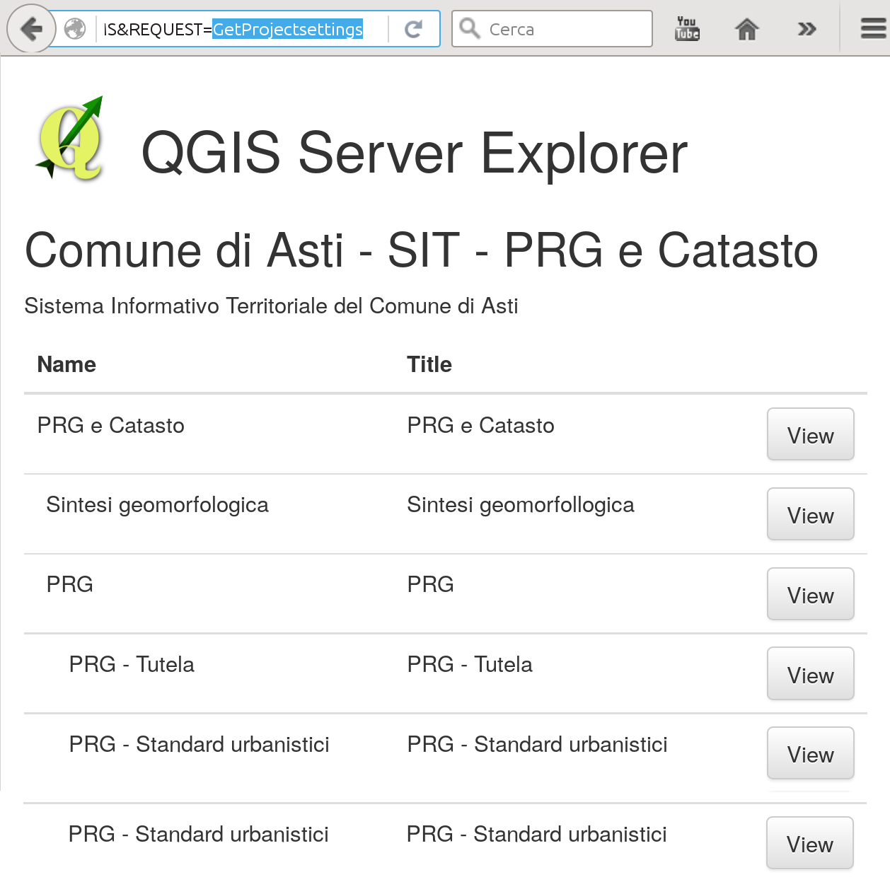
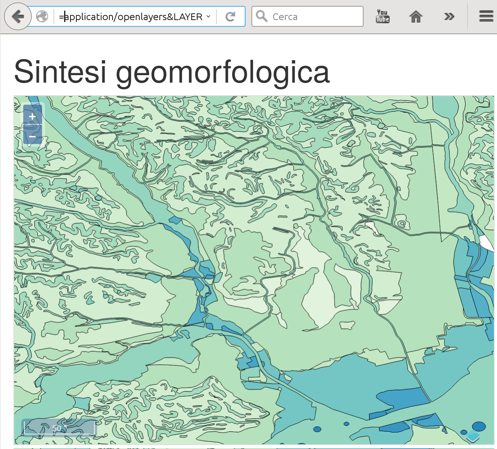

Simple Browser Python plugin for QGIS Server
============================================

This plugin adds a stylesheet to `GetProjectsettings` `WMS` requests, generating
an HTML page with the project's layer tree and a link to a OpenLayers map
preview of the layers.

The layer preview is generated by adding an new `application/openlayers` `FORMAT` to `GetMap`
requests.

For more informations on how to use Python plugins for QGIS Server, please refer
to a series of posts on our company website:

http://www.itopen.it/category/gis/qgis/qgis-server/

